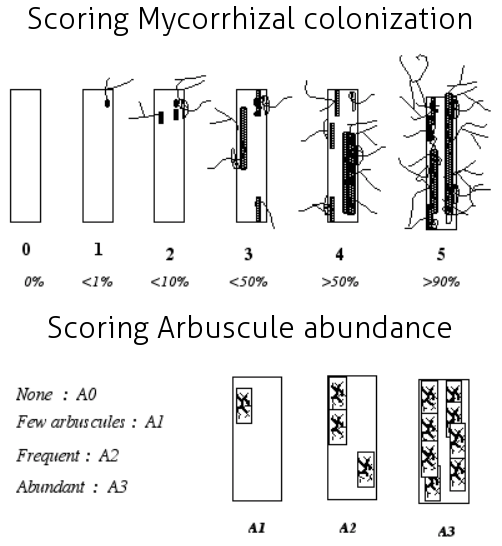

{{page.day2_pm}}

{{ site.time | date_to_string }}

<h1>Ramf package</h1>

<h2>Estimation of Arbuscular Mycorrhizal Fungi colonisation</h2> 

<h3>Estimation of mycorrhizal colonization according to Trouvelot method</h3>

- Mount 15 root fragments on one slide; prepare two slides (30 root fragments total).

- Observe these fragments under the microscope and rate according to the range of classes indicated in below figure.

These classes give a rapid estimation of the level of mycorrhizal colonisation of each root fragment and the abundance of arbuscules.

- Frequency of mycorrhiza in the root system

  - F% = ( nb of fragments myco/total nb) * 100

- Intensity of the mycorrhizal colonisation in the root system

  - M% = (95n5 + 70n4 + 30n3 + 5n2 + n1) / (nb total)
  - where n5 = number of fragments rated 5; n4 = number of fragments 4 etc.

- Intensity of the mycorrhizal colonisation in the root fragments

  - m% = M * (nb total) / (nb myco)

- Arbuscule abundance in mycorrhizal parts of root fragments

  - a% = (100mA3 + 50mA2 + 10mA1) / 100

  - where mA3, mA2, mA1 are the % of m, rated A3, A2, A1, respectively, with 
    - mA3=((95n5A3 + 70n4A3 + 30n3A3 + 5n2A3 + n1A3) / nb myco) \* 100 / m
    - mA2=((95n5A2 + 70n4A2 + 30n3A2 + 5n2A2 + n1A2) / nb myco) \* 100 / m
    - mA1=((95n5A1 + 70n4A1 + 30n3A1 + 5n2A1 + n1A1) / nb myco) \* 100 / m

- Arbuscule abundance in the root system

  - A% = a * (M / 100)

<h3>Estimation of mycorrhizal colonization according to Grid method</h3>

